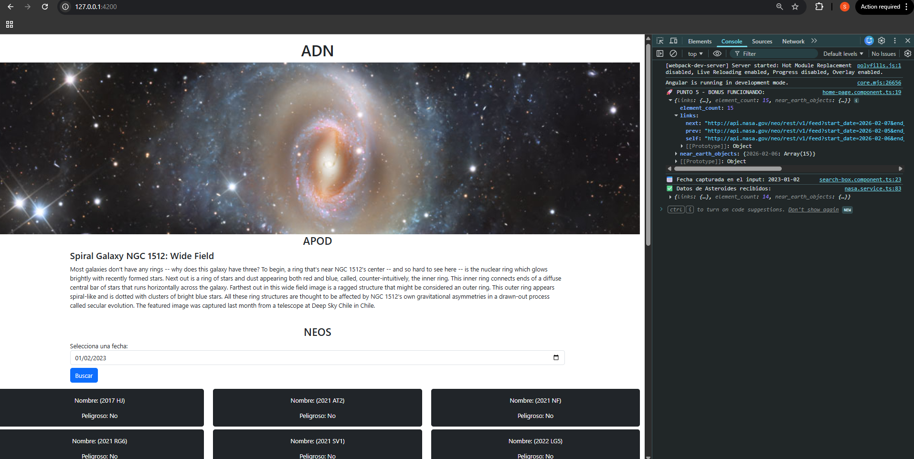
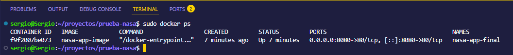

# NASA App - Prueba Técnica Frontend

Aplicación desarrollada en **Angular** para la visualización de datos espaciales utilizando las APIs oficiales de la NASA. Este proyecto demuestra el consumo de servicios REST, manejo de estados asíncronos y despliegue mediante contenedores Docker.

## 🛠️ Tecnologías Utilizadas

* **Angular 16+** (Framework principal)
* **Bootstrap** (Diseño y maquetación responsiva)
* **Docker & Nginx** (Contenerización y servidor web)
* **NASA APIs** (Endpoints: APOD y NeoWs)

## 🚀 Instalación y Despliegue con Docker

Para ejecutar la aplicación en un entorno local utilizando Docker, siga estos pasos:

1. **Construir la imagen del contenedor:**
   ```bash
   sudo docker build -t nasa-app-image .


2.  **Ejecutar el contenedor (Mapeo al puerto 8080):**
    
    Bash
    
    ```
    sudo docker run -d -p 8080:80 --name nasa-app-final nasa-app-image
    
    ```
    
3.  **Acceso a la aplicación:** Abra su navegador de preferencia e ingrese a: [http://localhost:8080](https://www.google.com/search?q=http://localhost:8080)
    

----------

## 📸 Evidencias de Funcionamiento

### 1. Vista Principal (APOD)

Se visualiza correctamente la "Astronomical Picture of the Day" con una fecha aleatoria generada automáticamente.


### 2. Buscador de Asteroides (NEOs)

Filtro de búsqueda funcional que consulta y renderiza objetos cercanos a la Tierra según la fecha seleccionada.



### 3. Estado del Contenedor Docker

Verificación del despliegue exitoso mediante el comando `docker ps`, confirmando la disponibilidad del servicio.




----------

## 📄 Requisitos Cumplidos
-   [x] **Punto 3:** Consumo de APOD con fecha aleatoria.
    
-   [x] **Punto 4:** Buscador funcional de NEOWS por fecha.
    
-   [x] **Punto 5 (Bonus):** Servicio adicional con log informativo en consola.
    
-   [x] **Punto 6:** Dockerización completa y despliegue sobre Nginx